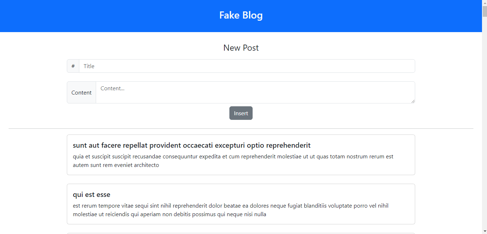

<h1 align="center"> Fake Blog </h1>

"Fake Blog" is a web project developed to study API concepts and requests in JavaScript. Using the fetch() library, the project consumes the JSONPlaceholder API to display posts in a simple and intuitive table.  

  <a href="#-tecnologias">Technologies</a>&nbsp;&nbsp;&nbsp;|&nbsp;&nbsp;&nbsp;
  <a href="#-projeto">Project</a>

 

  

## 🚀 Technologies

This project was developed with the following technologies:

  
  
  

## 💻 Project
The "Fake Blog" project is a web application that uses the JSONPlaceholder fake API to display information on an HTML page. The project aims to study concepts of API consumption and requests in JavaScript.

The project displays post data provided by the API. Each post is displayed on the page with its title and description. The project's interface is simple and intuitive, with the data displayed in an easy-to-read table.

The project was developed using the fetch() library in JavaScript to make HTTP requests to the API and display the information on the HTML page.

- [Online Project!](https://micaelsantiago.github.io/FakeBlog/)

## 🤝 Collaborators

<table>
  <tr>
    <td align="center">
      <a href="http://github.com/micaelsantiago">
         
        
          <b>micaelsantiago</b>
        
      </a>
    </td>
  </tr>
</table>

## :dart: Project status
* Concluded! :ballot_box_with_check:
